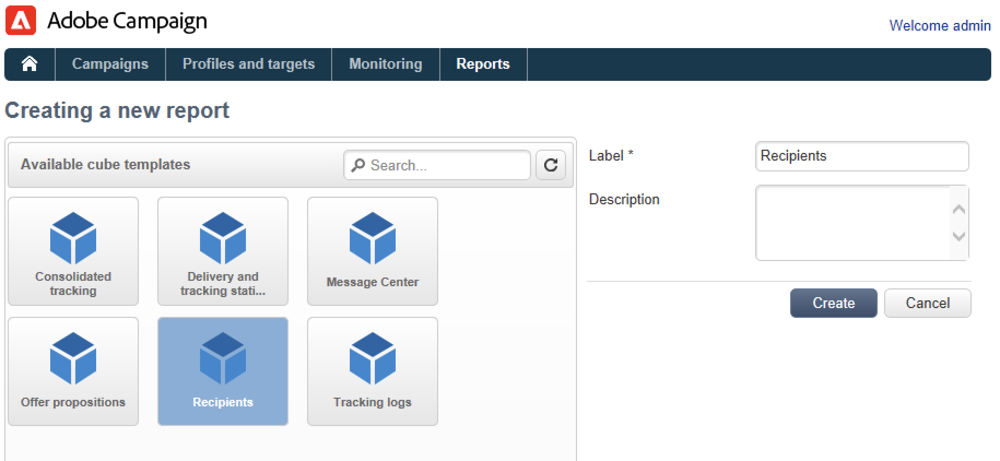

# Metrics & reports

## Get Started with reporting{#gs-ac-reports}

Adobe Campaign provides a set of reporting tools listed in this page.

* **Built-in reports**

    Adobe Campaign comes with reports on deliveries, campaigns, platform activities, optional capabilities, etc. These reports are available via the various functionalities which they relate to. They can be adapted to suit your specific needs. 

    Use the **Reports** tab to access these reports.

    

    ↗️ Campaign built-in reports are presented in [Campaign Classic v7 documentation](https://experienceleague.adobe.com/docs/campaign-classic/using/reporting/accessing-built-in-reports/about-campaign-built-in-reports.html){target="_blank"}

* **Descriptive data analysis**

    Adobe Campaign provides a visual tool for producing statistics on the data in the database. You can create descriptive analysis reports using a dedicated assistant and adapt their content and layout depending on your needs. 

    Use the **[!UICONTROL Tools > Descriptive analysis...]** menu to create a new report.

    

    ↗️ Campaign Descriptive analysis reporting is presented in [Campaign Classic v7 documentation](https://experienceleague.adobe.com/docs/campaign-classic/using/reporting/analyzing-populations/about-descriptive-analysis.html){target="_blank"}

* **Personalized reports** 

    Use Adobe Campaign to create reports on the data in the database. Once these have been created, make them accessible in the appropriate contexts.

    ↗️ Steps to create a report are detailed in [Campaign Classic v7 documentation](https://experienceleague.adobe.com/docs/campaign-classic/using/reporting/creating-new-reports/about-reports-creation-in-campaign.html){target="_blank"}. Personalized report creation is reserved to advanced users.

* **Cubes**

    Analyze and measure data, calculate statistics, simplify and optimize report creation and calculation with Cubes.  You can extend the database exploration and analysis capacities and make it easier for end users to configure reports and tables. All they need to do is select an existing (fully configured) cube when creating their report or table to process calculations, measures and statistics.

    

    Depending on the complexity of the queries, calculations and volumes, the data analyzed in these reports can be collected via a query and pre-aggregated in a list (data management type workflow) or in a Cube (using Marketing Analytics). It will be displayed in the form of a pivot table or a group list.

    ↗️ Learn how to create Cubes in [Campaign Classic v7 documentation](https://experienceleague.adobe.com/docs/campaign-classic/using/reporting/designing-reports-with-cubes/about-cubes.html){target="_blank"}

 
Note that Adobe Campaign reports are optimized and offer better scale capabilities than Campaign Classic v7. Existing limitations on Cubes do not apply.

